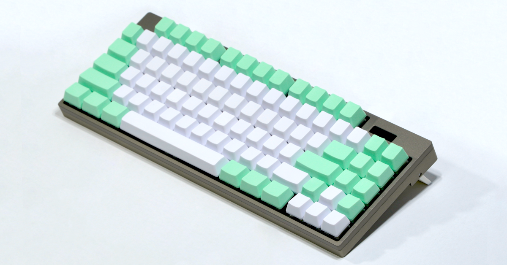
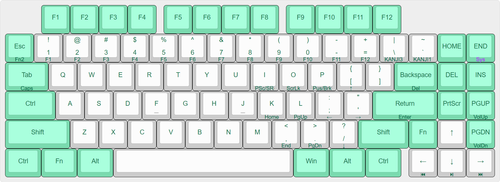

# EhHHKB2

[ブログ記事](https://blog.n0n5ense.com/blog/DcFo77JwRCHzNenNpN4wraU0PMD/)

Raspberry Pi Pico 2 W（RP2350 + CYW43）を載せた自作キーボード。
85 キー（8×11 マトリクス / 6 行）、USB HID と BLE HID の両対応で、
BLE は6ホストを記憶して切り替えられる。128x32 OLED で状態表示と設定操作ができる。

## ディレクトリ

| ディレクトリ | 内容 |
| --- | --- |
| `board/` | KiCad 10 のプロジェクト一式（回路図・PCB・プロジェクト専用ライブラリ） |
| `case/` | ケースの 3D データ（STEP）とレンダー画像 |
| `firmware/` | Pico SDK ベースのファームウェア（C）、ホスト単体テスト、ドキュメント生成スクリプト |

